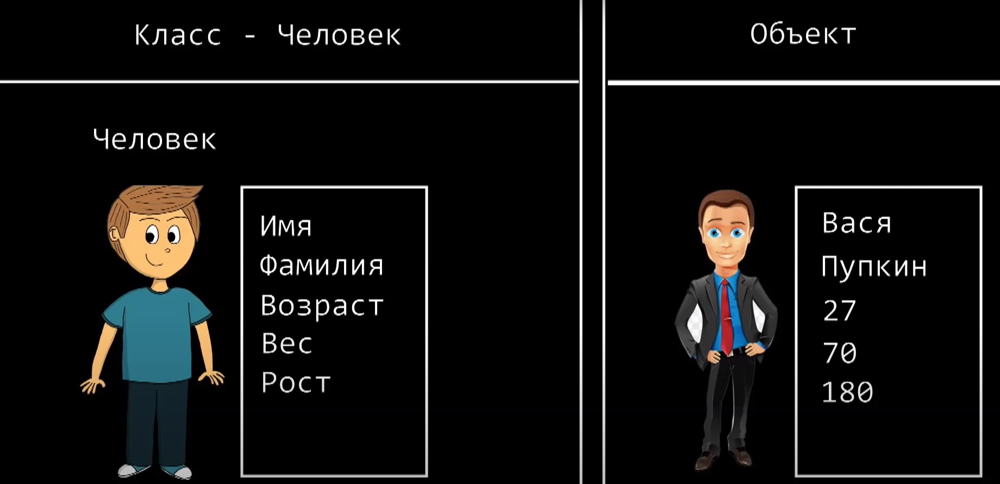
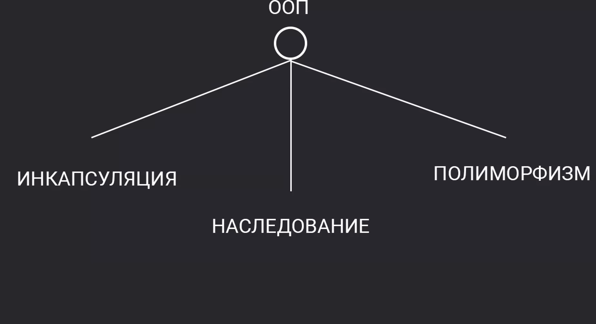
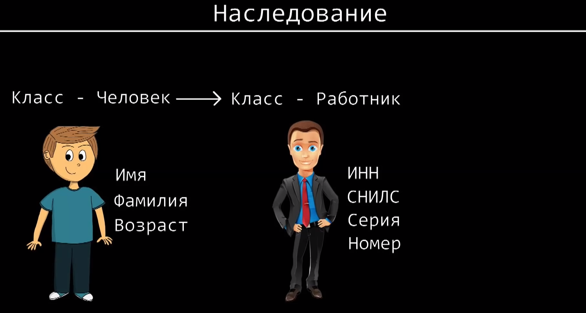
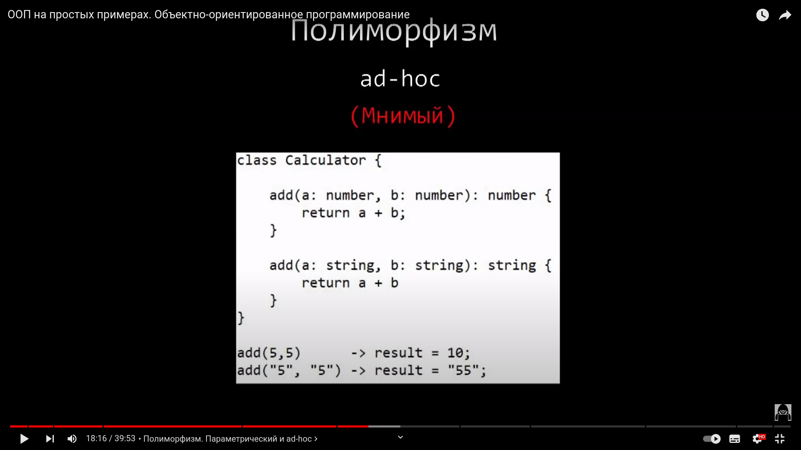
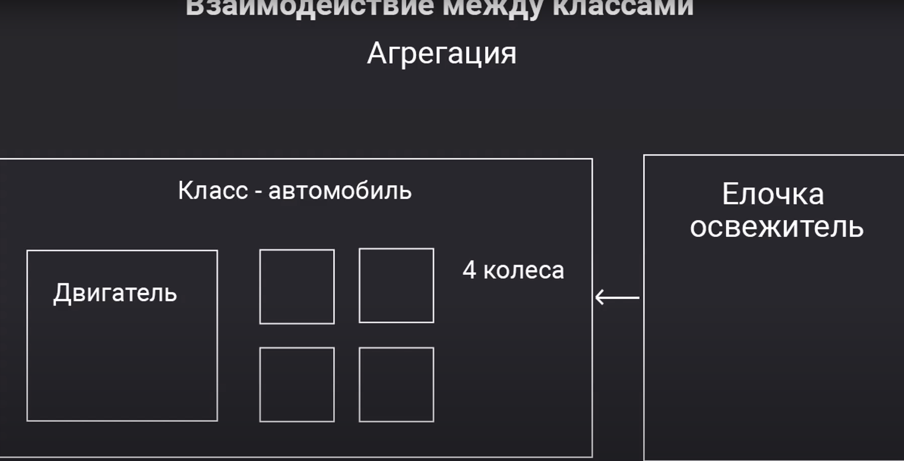
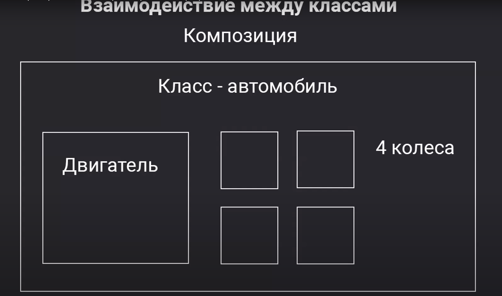
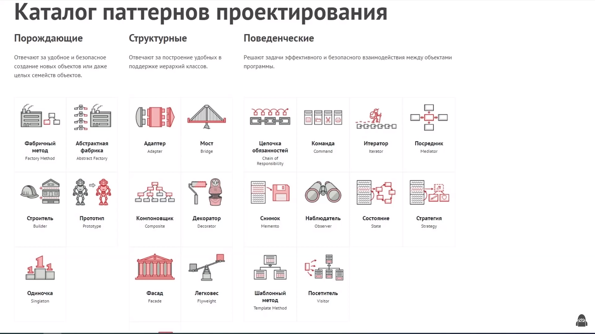

# ООП

- Паради́гма программи́рования — это совокупность идей и понятий, определяющих стиль написания компьютерных программ (подход к программированию).

# Классы

- В объектно-ориентированном программировании класс – это расширяемый шаблон кода для создания объектов, который устанавливает в них начальные значения (свойства) и реализацию поведения (методы).
- В JavaScript класс – это разновидность функции.

Есть человек - это класс
Конкертный представитель класса - это экзепляр, экземпляр это обьект

допусти же имя, фамилия, возраст и т.д - являются свойствами
а действия класса - называются методами

# Конструктор

- У любого класса есть конструктор - это метод, некоторый блок инструкций который вызывается при создании обьекта. Также он можешь принимать в себя некие аргументы, обычно в конструкторе свойствам обьекта присваиваются некоторые значения

# Оператор New

- С помощью опертора new мы можем создать обьект, как говорили обьект это экземпляр какого то класса

# Принципы ООП

# =========================== Инкапсуляция =======================

- Инкапсуляция - это упаковка данных и функций в один компонент (например, класс) и последующий контроль доступа к этому компоненту, создавая тем самым "чёрный ящик" из объекта. По этой причине, пользователю необходимо знать только интерфейс этого класса (то есть данные и функции, предоставляемые для взаимодействия с классом извне), а не то, как он реализован внутри.

- У каждого человека есть свои публичные данные допустим же имя,фамилия, возраст
  По сути разработчик предусмотрел из любого места он может обратиться к классу и при том логика работы не нарушится, но по мимо всего есть и закрытая часть то с чем мы не можем работать допустим качать кровь, переваривать пищу это скрытая часть которая находится внутри человека на которую из вне мы повлиять не можем

- Чтобы сделать методы и свойства публичными и приватными существуют модификаторы доступа - public или private
- Методы и свойства которые помеченны модифакатором private можно использовать только внутри класса, из вне невозможно

### Модификатор доступа

- Модификаторы доступа — это ключевые слова с помощью которых осуществляется управление сокрытием данных в классе. Простыми словами, модификаторы доступа задают уровень доступности членам класса ограничивая область их видимости.

- В TypeScript существует три модификатора доступа указывающихся с помощью ключевых слов `public`, `protected` и `private`. Влияние модификаторов доступа ограничивается TypeScript и после компиляции от них не остается ни следа. В скомпилированном коде нет никакой разницы между членами к которым были применены те или иные модификаторы доступа.

##### GET, SET

- Свойства-аксессоры представлены методами: «геттер» – для чтения и «сеттер» – для записи. При литеральном объявлении объекта они обозначаются get и set

# ========================== Унаследование =========================

Наследование классов – это способ расширения одного класса другим классом.

Таким образом, мы можем добавить новый функционал к уже существующему.

### EXTENDS

- Одним из ключевых моментов объектно-ориентированной парадигмы является наследование. В TypeScript наследование реализуется с помощью ключевого слова extends (как в Java):

###### SUPER()

- Super не уникален для Javascript — многие языки программирования, включая Java и Python, имеют ключевое слово super(), которое предоставляет ссылку на родительский класс. Но JavaScript, в отличие от Java и Python, не строится вокруг классической модели наследования классов. Вместо этого он использует прототипную модель наследования JavaScript, обеспечивая поведение, соответствующее наследованию классов. (Чем прототипное наследование отличается от классического?)

# =============== Полиморфизм ==================

- В языках программирования и теории типов полиморфизмом называется способность функции обрабатывать данные разных типов.

- Полиморфизм, если перевести, - это значит "много форм". Например, актер в театре может примерять на себя много ролей - или принимать "много форм". Так же и наш код - благодаря полиморфизму он становится более гибким, чем в языках программирования, которые не используют принципы ООП

- Термин “полиморфизм” обозначает семейство различных механизмов, позволяющих использовать один и тот же участок программы с различными типами в различных контекстах.

- Что такое полиморфизм в JS?
  Полиморфизм - это представление одного интерфейса для разных типов данных. Например, целые числа (integers), числа с плавающей запятой (floats) и числа с плавающей запятой двойной точности (double) полностью полиморфны: независимо от их отличающихся типов, их можно складывать, вычитать, перемножать, и так далее.

- Изменение поведение Родительского метода (переписование)

#### Типы полиморфизма

## Параметрический (Истинный)

- Параметрический полиморфизм — это универсальный вид полиморфизма. Как было сказано ранее, данный вид полиморфизма позволяет описывать вычисления в общем виде. Другими словами, существует возможность описывать функции, которые будут работать с любыми типами данных. Такие функции называют параметрически полиморфными.

- Когда мы описываем обычную функцию, мы указываем, какого типа она принимает аргументы, например, String, Number. В случае полиморфных функций мы можем использовать переменные для типов (<T>) вместо настоящих типов, где вместо <T> будет доставлено String или Number.

- Для демонстрации параметрического полиморфизма позаимствуем довольно простую функцию тождества, которая принимает аргумент и возвращает его — все просто. Однако функция должна работать со всеми типами.

## Ad-Hoc (Мнимый)

- Когда один метод работает с двумя типами данных, идет перегрузка методов, такой полиморфизм считается мнимым
- Также еще Add-Hoc является приведением типо, это когда мы дочерний класс приобразовываем в родителю

==================

### Перезагрузка

- Перегрузка — это разновидность специального полиморфизма. Такой вид полиморфизма позволяет объявлять функции с одним и тем же именем, но с разными типами аргументов и их количеством (арностью). Говоря другими словами, у функции может быть несколько сигнатур.

- “Самый обычный пример специализированного полиморфизма — перегрузка (overloading), когда один и тот же символ функции соответствует различным реализациям; компилятор (или система времени выполнения, в зависимости от того, идет ли речь о статическом (static) или динамическом (dynamic) разрешении перегрузки) выбирает подходящую реализацию для каждого случая применения функции, исходя из типов ее аргументов.”

==================

### Полиморфизм включений

- Полиморфизм включений — это универсальный вид полиморфизма (согласно статье Лука Карделли и Питера Вегнера). В этом виде полиморфизма функции или операторы могут содержать один или множество аргументов, типы которых имеют подтипы.

============

### Интерфейсы и полиморфизм

- Очень интересной особенностью интерфейсов является то, что они обеспечивают некоторую разновидность полиморфизма. Суть в том, что интерфейсы могут трактоваться как типы. К примеру, некоторый формальный параметр метода определяется как интерфейс. Такому формальному параметру соответствует фактический параметр любого класса, который реализует интерфейс. Следовательно, метод становится полиморфным

=================

### Утиная типизация

##### Что такое утиная типизация ?

- Утиная типизация – это концепция, характерная для языков программирования с динамической типизацией, согласно которой конкретный тип или класс объекта не важен, а важны лишь свойства и методы, которыми этот объект обладает.

- Способность функции обрабатывать объекты разных типов одинаковым образом — называется полиморфизмом подтипов, а сама функция – полиморфной функцией. Как видно из кода выше, для реализации такого полиморфизма, в JavaScript не нужно наследование и интерфейсы. В мире такой подход называют "утиной типизацией".

- Функция ожидает, что любой объект, который будет передан в качестве аргумента «умеет говорить», то есть имеет метод say, это, кстати, называется утиной типизацией. Утиная типизация не является полиморфизмом.

- Почему утиная типизация не является полиморфизмом? Утиная типизация присуща динамически типизированным языкам. Это неявная типизация, в которой типы не определяются на уровне синтаксиса. С точки зрения утиной типизации, если два объекта имеют одинаковое поведение, то они относятся к одному типу, например:

======================

# ============= Агрегация, композиция и Ассоциация ====================

- Композиция, агрегация и ассоциация эти три понятия очень похожи друг на друга. Все они означают что внутри одного объекта будет существовать другой объект.

# Ассоциация

- Ассоциация – это когда один класс включает в себя другой класс в качестве одного из полей. Ассоциация описывается словом «имеет». Автомобиль имеет двигатель. Вполне естественно, что он не будет являться наследником двигателя (хотя такая архитектура тоже возможна в некоторых ситуациях).

# =========== Агрегация =============

- Агрегация - распространённый вариант использования циклов с массивами — агрегация. Агрегацией называются любые вычисления, которые, как правило, строятся на основе всего набора данных, например, поиск максимального, среднего, суммы и так далее.

- Агрегация – это разновидность ассоциации при отношении между целым и его частями (отношение типа:«Я знаю о… и без этого могу существовать»). Одно отношение агрегации не может включать более двух классов (контейнер и содержимое).
  

# ======== Композиция =========

- Композиция – более строгий вариант агрегации. Композиция имеет жёсткую зависимость времени существования экземпляров класса-контейнера и экземпляров содержащихся классов. Если контейнер будет уничтожен, то всё его содержимое будет также уничтожено. (Отношение типа:«Я знаю о… и без этого не могу существовать»).
  

================================

# ====================== Интерфейсы и Абстрактные классы ======================

# Интерфейс

- Интерфейс определяет свойства и методы, которые объект должен реализовать. Другими словами, интерфейс - это определение кастомного типа данных, но без реализации. В данном случае интерфейсы в TS похожи на интерфейсы в языках Java и C#. Интерфейсы определяются с помощью ключевого слова interface.

# Интерфейсы классов

- Интерфейсы могут быть реализованы не только объектами, но и классами. Для этого используется ключевое слово implements:

# Абстрактные классы

- Абстрактные классы представляют классы, определенные с ключевым словом abstract. Они во многом похожи на обычные классы за тем исключением, что мы не можем создать напрямую объект абстрактного класса, используя его конструктор.

- Абстрактные классы используются в качестве обобщенных концепций, на основе которых можно создавать более конкретные производные классы. Невозможно создать объект абстрактного типа класса.

# Что такое абстрактный класс простыми словами?

- Абстрактный класс — это класс, у которого не реализован один или больше методов (некоторые языки требуют такие методы помечать специальными ключевыми словами). Интерфейс — это абстрактный класс, у которого ни один метод не реализован, все они публичные и нет переменных класса.

==================================

# ============== Каталог паттернов проектирования ==============

[Ссылка на полное проектирование](https://refactoring.guru/ru/design-patterns/catalog)
